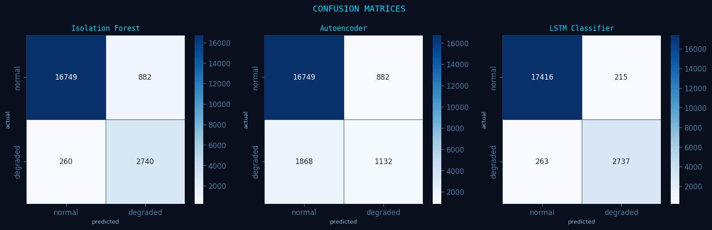
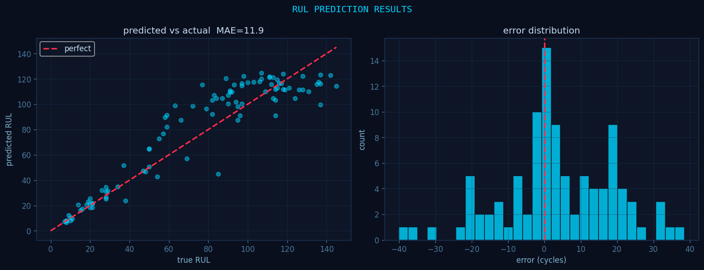
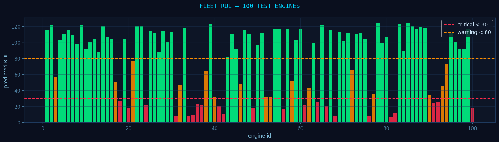
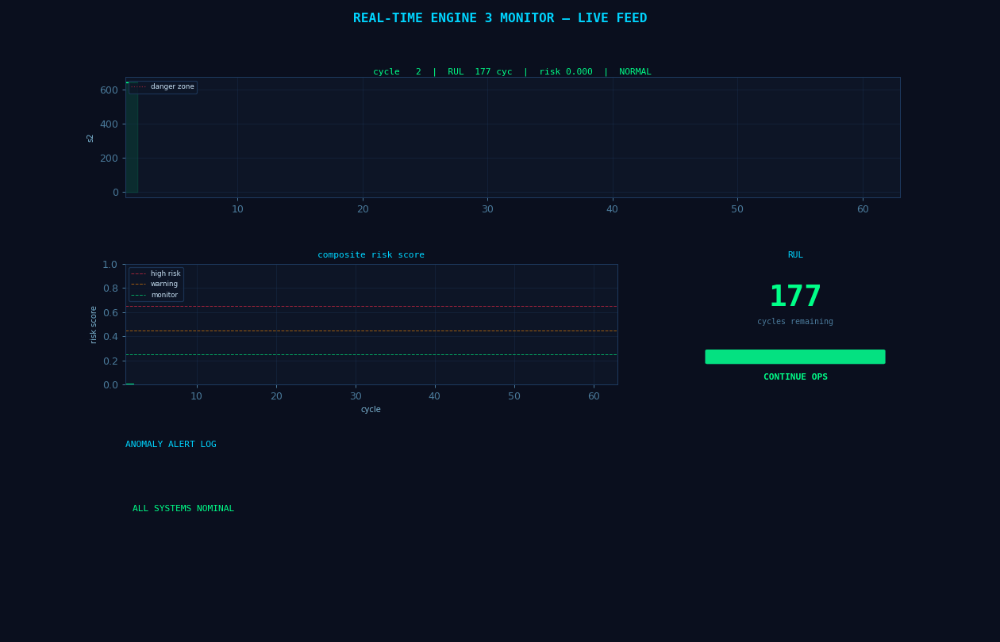

# AI-Based Real-Time Anomaly Detection and Autonomous Decision Support System for Deep Space Missions

India Space Academy — 21-Day AI/ML Project
Hosted on indiaspaceweek.org

---

**Raja**
B.Sc. (Hons.) Physics, Semester IV
Hindu College, University of Delhi

---

## About the Project

Deep space missions have no option for real-time human intervention. If an engine starts degrading and nobody catches it in time, the mission fails. This project builds a system that watches engine sensor data continuously, detects when something is going wrong, predicts how many cycles the engine has left, and tells the operator what to do — all automatically.

The dataset used is the NASA CMAPSS Turbofan Engine Degradation Dataset (FD001), which contains real sensor readings from turbofan engines running until failure.

---

## Models Used

Three models were built and compared:

- **Isolation Forest** — a classical unsupervised method that isolates anomalies in the sensor data
- **Autoencoder** — a neural network trained to reconstruct normal data; anomalies produce high reconstruction error
- **LSTM Classifier** — a recurrent deep learning model that learns temporal degradation patterns over time

---

## Results

### Anomaly Detection

| Model | Precision | Recall | F1-Score |
|---|---|---|---|
| Isolation Forest | 0.756 | 0.913 | 0.828 |
| Autoencoder | 0.562 | 0.377 | 0.452 |
| LSTM Classifier | 0.927 | 0.912 | 0.920 |

The LSTM Classifier performed best with an F1-score of 0.920. The Autoencoder struggled with recall, missing a large number of degraded engines.

### Confusion Matrices



| Model | TN | FP | FN | TP |
|---|---|---|---|---|
| Isolation Forest | 16749 | 882 | 260 | 2740 |
| Autoencoder | 16749 | 882 | 1868 | 1132 |
| LSTM Classifier | 17416 | 215 | 263 | 2737 |

### RUL Prediction



| Metric | Value |
|---|---|
| MAE | 11.91 cycles |
| RMSE | 15.63 cycles |

On average the model predicts remaining engine life to within about 12 cycles of the true value. The error distribution is centred at zero with no systematic bias.

### Fleet Dashboard



Out of 100 test engines:
- 62 normal (RUL above 80 cycles)
- 16 warning (RUL between 30 and 80 cycles)
- 22 critical (RUL below 30 cycles)

### Real-Time Monitor



The animated dashboard tracks Engine 3 across 180 cycles. It shows live sensor readings, a composite risk score updating every cycle, a RUL countdown, and a scrolling anomaly alert log with recommended actions. The animation runs from all systems nominal at the start through to an emergency shutdown alert as the engine approaches failure.

---

## Tech Stack

- Python 3
- scikit-learn, TensorFlow/Keras, NumPy, Pandas, Matplotlib, Seaborn
- Kaggle Notebooks
- Dataset: NASA CMAPSS FD001

---

## Project Structure

```
deep-space-anomaly-detection/
├── code/
│   └── deep_space_anomaly_detection.ipynb
├── results/
│   ├── plot_confusion_matrices.png
│   ├── plot_rul_results.png
│   ├── plot_fleet.png
│   └── realtime_monitor.gif
└── report/
    ├── technical_report.docx
    └── presentation.pptx
```

---

India Space Academy | Department of Space Education | www.isa.ac.in
